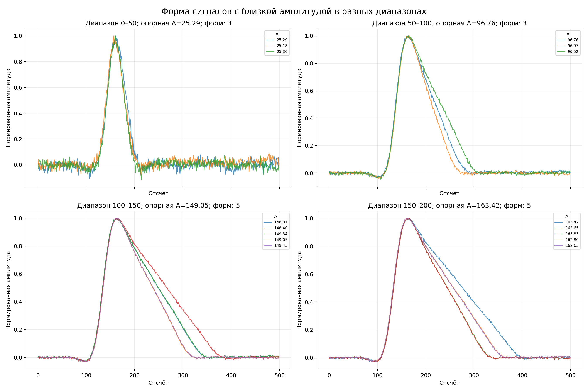

# STEAMinDREAM

Учебные материалы и анализ сигналов нейтронного детектора.

## Содержимое

- `DataR_CH1_run136_6.csv` — исходные данные измерений.
- `data_4W_sem.csv` — набор из 3000 сигналов по 500 отсчётов.
- `Неделя 3_НС_Нейтроны_Семинар.ipynb` — семинарский Jupyter Notebook.
- `Анализ_сигналов_задания_1-3.ipynb` — чистый выполненный ноутбук с решениями трёх заданий, графиками и выводами.
- `Кластеризация_типов_сигналов.ipynb` — отдельный выполненный ноутбук с автоматическим разделением сигналов на три типа.
- `PSD_разделение_двух_типов_сигналов.ipynb` — отдельный выполненный ноутбук с разделением на два класса по отношению площади хвоста к полной площади.
- `Неделя 2_НС_Неуловимые нейтроны_Презентация_01bdc9db.pdf` — презентация.
- `analyze_signals.py` — воспроизводимый анализ выбросов и формы сигналов.
- `signal_analysis/` — итоговые графики, таблицы метрик и отчёт.

## Результаты анализа

В `data_4W_sem.csv` найдено 583 уникальные формы. Робастный анализ параметров
сигнала выделил 2 уникальные аномальные формы, встречающиеся в 13 строках.
Также выполнено сравнение сигналов с отличием амплитуды не более 0,5% в четырёх
амплитудных диапазонах.



Подробности находятся в [`signal_analysis/README.md`](signal_analysis/README.md).
Готовое пошаговое решение находится в [`Анализ_сигналов_задания_1-3.ipynb`](Анализ_сигналов_задания_1-3.ipynb).
Классификация всех сигналов находится в [`Кластеризация_типов_сигналов.ipynb`](Кластеризация_типов_сигналов.ipynb).
PSD-разделение двух классов находится в [`PSD_разделение_двух_типов_сигналов.ipynb`](PSD_разделение_двух_типов_сигналов.ipynb).

## Запуск

```bash
python3 -m pip install -r requirements.txt
python3 analyze_signals.py
```

Скрипт заново формирует таблицы и графики в каталоге `signal_analysis/`.
